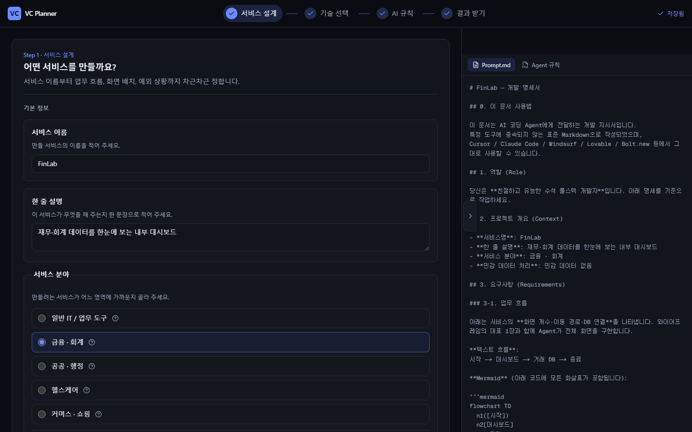
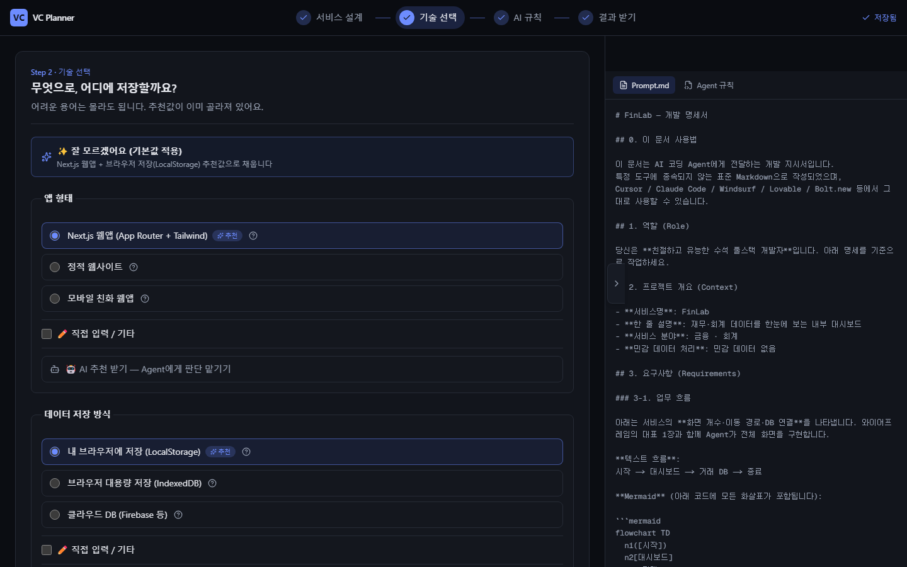
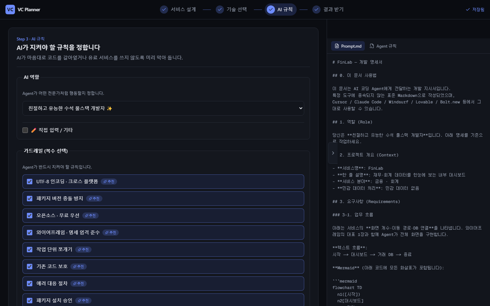
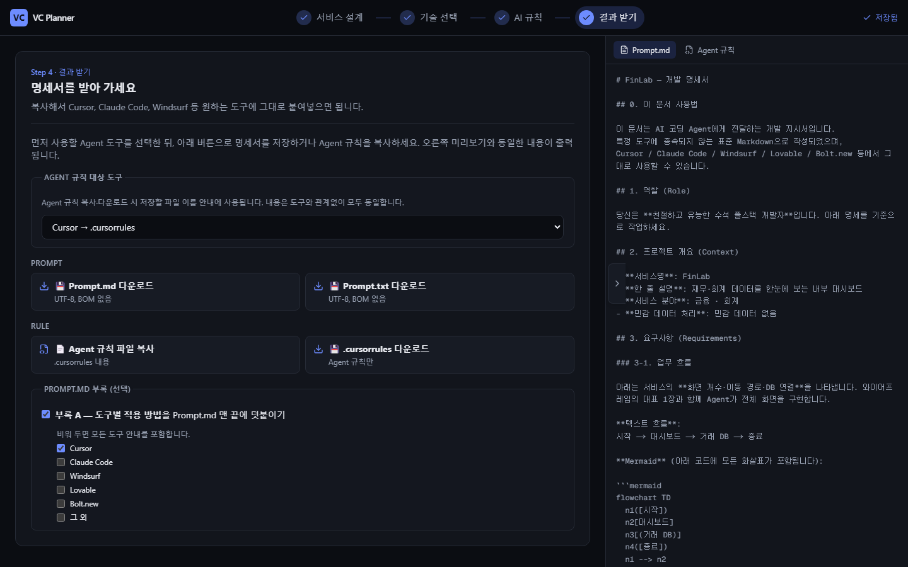
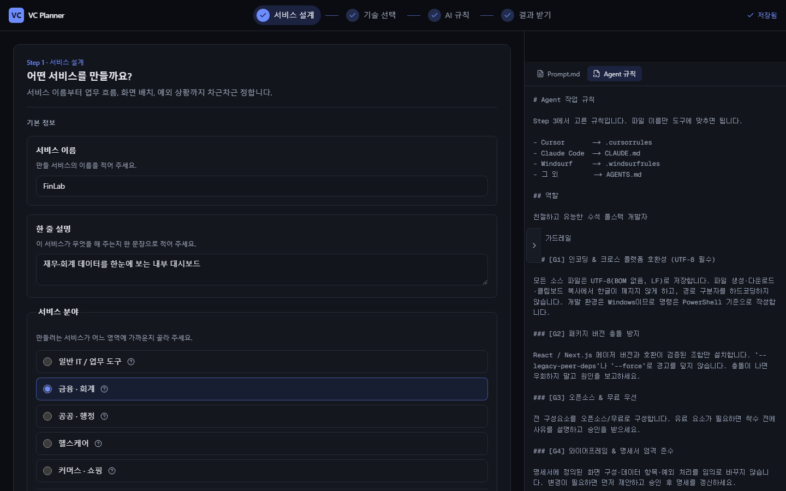

# VC Planner

**비개발자도 단계별 질문만으로 AI 코딩 Agent용 개발 명세서를 만드는 웹 도구**

🌐 **Live Demo:** [https://vc-planner.pages.dev/](https://vc-planner.pages.dev/)

코딩을 몰라도 괜찮습니다. 서비스 이름·업무 흐름·화면 배치·AI가 지켜야 할 규칙을 차례대로 정하면, **Cursor / Claude Code / Windsurf / Lovable / Bolt.new** 등에 바로 넘길 수 있는 **`Prompt.md`** 와 **Agent 규칙 파일**이 만들어집니다.

---

## VC Planner란?

| | |
|---|---|
| **입력** | Step 1~3 위저드 (텍스트 · 선택 · 드래그 편집) |
| **출력** | `Prompt.md` (표준 Markdown) + Agent 규칙 (`.cursorrules` 등) |
| **저장** | 브라우저 **LocalStorage**만 사용 — **서버로 전송되지 않음** |
| **비용** | 무료 이용 (Cloudflare Pages 정적 호스팅) |

생성된 명세서의 **저작권은 작성자 본인**에게 있습니다. VC Planner 소스코드만 [BUSL-1.1 (source-available)](LICENSE)로 보호됩니다.

---

## 4단계로 끝나는 흐름

```
Step 1 서비스 설계  →  Step 2 기술 선택  →  Step 3 AI 규칙  →  Step 4 결과 받기
     (무엇을 만들지)      (어떻게 만들지)      (Agent 가드레일)      (다운로드·복사)
                              ↕ 실시간 미리보기 (Prompt.md / Agent 규칙)
```

---

## 화면별 안내

### Step 1 — 서비스 설계

서비스의 **이름·분야·업무 흐름·대표 화면·입출력·예외 상황**을 한곳에서 정합니다.



| 영역 | 설명 |
|------|------|
| **기본 정보** | 서비스 이름, 한 줄 설명, 분야, 민감 데이터 여부 |
| **업무 흐름도** | 드래그로 노드를 배치하고 연결 → Mermaid `flowchart TD` 자동 생성 |
| **대표 화면 1장** | 그리드에 네비·사이드바·검색·본문 블록 배치 → ASCII 와이어프레임 자동 생성 |
| **입출력 · 예외** | CSV 업로드, KPI 카드, 빈 화면·에러 처리 방식 등 |

💡 **`✨ 기본 불러오기`** 로 CRUD 흐름도·공통 화면 틀을 한 번에 채울 수 있습니다.  
💡 **`✨ AI 추천`** 을 켜면 해당 항목을 Agent에게 맡기고, 명세서에 위임 지시문이 들어갑니다.

---

### Step 2 — 기술 선택

앱 형태(웹·모바일)와 데이터 저장 방식을 고릅니다. **추천값이 미리 선택**되어 있어 그대로 넘어가도 됩니다.



| 항목 | 기본 추천 |
|------|-----------|
| 앱 형태 | Next.js 웹앱 |
| 저장 방식 | 브라우저 LocalStorage |

**`✨ 잘 모르겠어요 (기본값 적용)`** 으로 언제든 추천 조합으로 되돌릴 수 있습니다.

---

### Step 3 — AI 규칙

AI가 코드를 작성할 때 지켜야 할 **역할**과 **가드레일**(UTF-8, 무료·오픈소스 우선, 작업 단위 쪼개기 등)을 정합니다.



| 기능 | 설명 |
|------|------|
| **역할 선택** | 예: 수석 풀스택 개발자 |
| **가드레일 G1~G12** | Plan.md 기준 체크리스트 — G1~G9는 기본 체크 |
| **민감 데이터 연동** | Step 1에서 민감 데이터를 고르면 G10(보안)이 자동 잠금 |

---

### Step 4 — 결과 받기

사용 중인 Agent 도구를 고른 뒤, **Prompt**와 **Rule** 파일을 받습니다.



| 버튼 | 내용 |
|------|------|
| **Prompt.md / .txt 다운로드** | 0~8장 + 선택 부록이 담긴 전체 명세서 |
| **Agent 규칙 복사 · 다운로드** | Step 3 규칙 — Cursor(`.cursorrules`), Claude(`AGENTS.md`) 등 도구별 파일명 |

다운로드한 `Prompt.md`를 Agent 채팅창에 붙여넣거나, 규칙 파일을 프로젝트 루트에 저장하면 됩니다.

---

### 실시간 미리보기

데스크톱(lg 이상)에서는 **우측 서랍**에서 입력 내용이 곧바로 `Prompt.md` / Agent 규칙으로 반영됩니다. 기본 **열림** 상태이며, 화면 가장자리 버튼으로 접을 수 있습니다.



모바일·태블릿에서는 **하단 「미리보기」 버튼**으로 시트 형태로 열립니다.

---

## 이런 분께 추천합니다

- 아이디어는 있는데 **개발 명세서를 어떻게 써야 할지** 막막한 분
- Cursor·Claude Code 등 **AI Agent에게 일관된 지시**를 내리고 싶은 분
- **와이어프레임·업무 흐름도**를 글로 설명하기 어려운 분
- 서버·회원가입 없이 **브라우저에서만** 설계하고 싶은 분

---

## 개발자용 — 로컬 실행

| 항목 | 버전 |
|------|------|
| Node.js | ≥ 20 |
| Next.js | 15 (Static Export) |
| React | 19 |

```powershell
git clone https://github.com/lky9464/VC_Planner.git
cd VC_Planner
npm install
npm run dev
```

브라우저에서 [http://localhost:3000](http://localhost:3000) 을 엽니다.

```powershell
npm run build   # 정적 산출물 → out/
```

| 문서 | 설명 |
|------|------|
| [`Plan.md`](Plan.md) | 개발 명세 (Single Source of Truth) |
| [`docs/DEPLOY.md`](docs/DEPLOY.md) | Cloudflare Pages 배포 가이드 |
| [`docs/HANDOFF.md`](docs/HANDOFF.md) | 세션 인수인계 |

README 스크린샷 재생성: `node scripts/capture-readme-screenshots.mjs` (Playwright 필요, `npm install --no-save playwright` 후 실행)

---

## 라이선스

| 대상 | 라이선스 |
|------|----------|
| **VC Planner 소스코드** | [BUSL-1.1 (source-available)](LICENSE) — OSI 승인 오픈소스 **아님** |
| **이 도구로 생성한 명세서** | **작성자 본인 소유** — 자유롭게 사용·수정·배포 가능 |
| **서드파티 라이브러리** | [`NOTICE`](NOTICE) 참조 |

- 웹 서비스 **이용**은 자유롭습니다.
- 소스코드의 **무단 재배포·재가공·상업적 재호스팅**은 금지됩니다.

자세한 정책은 `Plan.md` 12-3장을 참조하세요.
